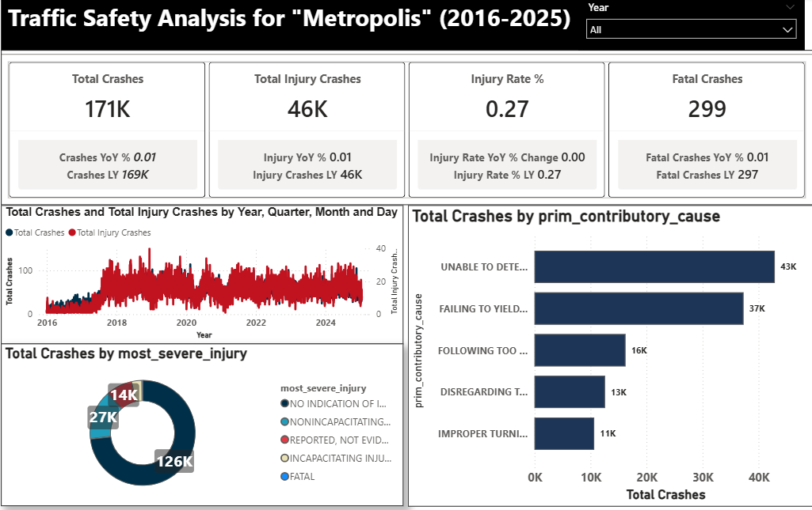
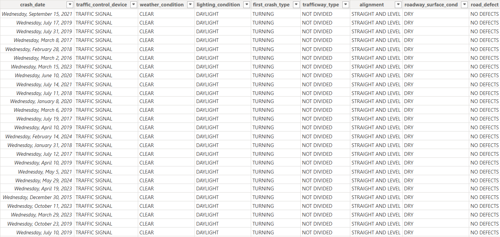

## traffic--safety--analysis--report-metropolis-(2016-2025)
prioritizing- infrastructure and Public Safety -for a Safer Tomorrow

## Dashboard

## Executive Summary
This report provides a comprehensive review of traffic accident data in Metropolis over a ten-year period. By analyzing over a decade of crash patterns, we have identified critical "danger zones," peak accident hours, and primary causes of fatal incidents. The findings indicate that while total crashes have fluctuated, the Injury Rate % remains a vital metric for assessing the severity of our roadways. This analysis serves as the data-driven foundation for the 2026 Public Safety Budget.

## The Business Problem
The Mayor’s office and the City Planning Department faced a lack of centralized, actionable insights regarding urban mobility safety. Without a clear understanding of where, when, and why crashes occur, the city risked misallocating resources. The objective was to transform raw, disconnected crash records into a visual narrative that justifies safety initiatives and infrastructure investments.

## Key Questions Addressed
-	What is the 10-year trend for total crashes vs. injury-related crashes?
-	What are the primary behaviors (causes) leading to fatalities?
-	Which roadway types are statistically the most dangerous?
-	At what specific times of day should emergency services and police be most alert?

## The Process (Methodology)
To ensure accuracy, the project followed a standard Data Analytics Lifecycle:
-	Requirement Gathering: Identifying KPIs (YoY growth, Injury Rates).
-	Data Processing: Converting raw CSV data into a relational model.
-	Analysis: Applying DAX (Data Analysis Expressions) to calculate time-intelligence metrics.
-	Visualization: Designing an intuitive two-page dashboard for non-technical stakeholders.

  ## Tools Used
-	Power BI Desktop: For ETL, Data Modeling, and Dashboarding.
-	Power Query: For data cleaning and "Damage Midpoint" calculations.
-	DAX: For Year-over-Year (YoY) comparison formulas and injury rates.

## Data Sourcing and Overview
The dataset, traffic_accidents.csv, spans from January 2016 to December 2025. It includes detailed variables such as:
-	Temporal Data: Crash date, month, and hour.
-	Environmental Data: Weather, lighting, and road surface conditions.
-	Outcome Data: Severity of injuries, fatality counts, and property damage ranges.

## Data Cleaning and Transformation (ETL)
Before analysis, the data underwent a rigorous "scrubbing" process:
-	Data Type Correction: Ensuring crash_date was recognized as a Date field.
-	Handling Nulls: Replacing "UNKNOWN" or missing values with "Not Reported" to prevent skewed averages.
-	Date Table Creation: A dedicated Calendar Table was built to enable Year-over-Year (YoY) time-intelligence.
-	Damage Midpoint: Text-based damage ranges (e.g., "$501–$1,500") were converted into numeric values to allow for financial impact summation.

## Dataset

## Analysis and Insights
- Injury Severity Profile: The majority of recorded incidents resulted in property damage only; however, a significant subset involved Fatal or Incapacitating injuries. The data shows that "Rear-end" and "Angle" collisions are the most frequent types of crashes, though they vary in severity based on the speed of the roadway.
-  Environmental Factors: A high volume of crashes occurs during clear weather and dry road conditions. This suggests that driver behavior and traffic volume are more significant contributors to accidents in Metropolis than hazardous weather conditions like rain or snow.
-  Contributory Causes: Human error is the primary driver of incidents. Factors such as "Failing to Yield Right-of-Way," "Following Too Closely," and "Distracted Driving" consistently rank as the top reasons for collisions across the 10-year period.
-  Roadway Correlation: Crashes are heavily concentrated on specific roadway types, particularly Divided Highways and Four-lane roads. These areas show a higher frequency of multi-unit involvements (accidents involving more than two vehicles) compared to local or residential streets.
-  Traffic Control Effectiveness: Locations with functional traffic control devices (stop signs and working signals) show a lower rate of fatal outcomes compared to uncontrolled intersections, highlighting the effectiveness of current traffic management hardware where it is installed.

## Recommendations
- Target High-Volume Causes: Launch public safety campaigns specifically targeting "Following Too Closely" and "Failure to Yield." Since these are the top human-error causes, driver education is the most cost-effective way to reduce crash volume.
-  Infrastructure Audits: Conduct immediate safety reviews of Divided Highways and Four-lane roadways. The high concentration of crashes in these areas suggests a need for better lane markings, longer merge lanes, or adjusted speed limits.
-  Intersection Safety: Prioritize the installation of traffic control devices (lights or stop signs) at intersections that currently have "None." Data shows that controlled intersections have significantly lower fatality rates.
-  Resource Allocation: Schedule increased traffic enforcement and emergency response standby during the identified peak traffic hours. Aligning personnel with these high-risk windows will improve response times and deter dangerous driving behavior.
-  Data-Driven Budgeting: Allocate a portion of the 2026 budget to automated traffic monitoring systems on the top 5 high-risk roadways to gather real-time data on speeding and light-running.

## Link
[Interactive Power BI](https://app.powerbi.com/view?r=eyJrIjoiMjI5N2E0YTgtNGQ1OC00NGI0LWJlOTMtMTcxOTVmN2U5ZjgxIiwidCI6IjI2ZGJlMWMyLTVhZDItNDRjZi1hNzMyLTJkZmM3YzQ3YWUxYiJ9)

